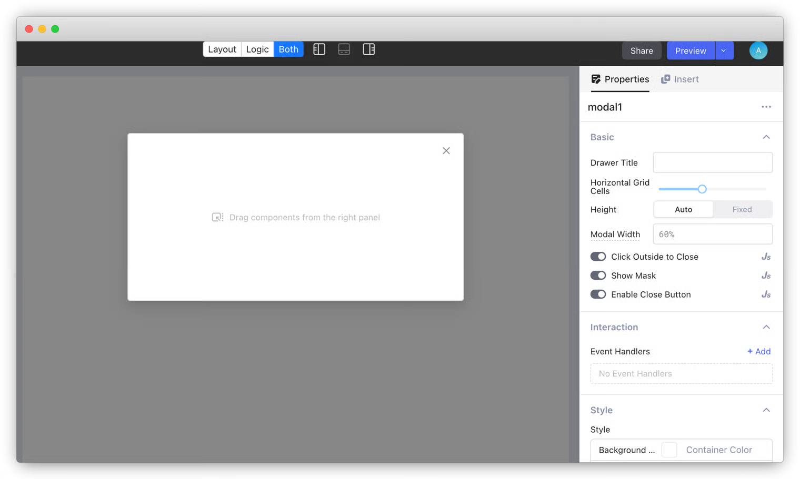

# Option lists

A drop menu ensures easy and error-free user input by offering a list of possible options. Lowcoder supports implementing option lists using components such as **Select** and **Multiselect**. You can configure an option list either manually or by mapping data from your data sources.

## Properties

Each option list has four properties.

* **Label**: the displayed text of the option to users
* **Value**: the unique identifier of the option
* **Disabled**: disable the option (the default value is `false`)
* **Hidden**: hide the option (the default value is `false`)


When more than one option in one list uses the same value, only the first option is valid and thus displayed.


## Manual mode

In Manual Mode, data is entered into a Component manually. Users have to add entries one by one. Some components with Manual mode of data entry are :

1. Select / Multi-Select
2. Dropdown

<figure><figcaption></figcaption></figure>

**Example :**

Let’s take an example where a User has to choose his/her favourite color from a list of colors. We will use the **Select** component for this example. Please, go via the following demo. All the details have been explained in it.

**App link :** [**https://app.lowcoder.cloud/apps/668e6c60ba4684206ee5d15e/view**](https://app.lowcoder.cloud/apps/668e6c60ba4684206ee5d15e/view)

**Demo :**&#x20;



Manual mode is recommended for these scenarios:

* Manually manageable and enumerable.
* Used by only one component.
* Data doesn't come from data sources.

## Mapped mode

In Mapped mode, data is usually coming from a Data source ( like an API or DB ), Transformer or Temporary state, Or it can be in JSON format. In other words, we use Mapped mode when we have dynamic data. Admin only needs to map the relevant data to respective fields, without mapping each value to a field. It’s fast and dynamic. E.g. we should use Mapped mode when we need to show a list of Countries name coming via an API. Some components with Mapped mode of data entry are :

1. Select / Multi-Select
2. Dropdown

<figure><figcaption></figcaption></figure>

**Example :**

Let’s take the 1st example where data is in JSON format, and contains a List of Objects where each object has a name and link fields. In the 2nd example, we show a list of all countries' names in a dropdown. Let’s go via following demo to understand the key concepts around Mapped data mode.

**App link :** [**https://app.lowcoder.cloud/apps/667eb219f0558f2f43e386c3/view**](https://app.lowcoder.cloud/apps/667eb219f0558f2f43e386c3/view)

**Demo :**&#x20;



**When to use Mapped Mode:**

* When we have data coming from a Data source like API or DB, Transformer or Temporary state.
* When data is used by multiple components.

### Key difference b/w Manual & Mapped Mode : 

<table><thead><tr><th width="270">Details</th><th width="214">Use Manual Mode</th><th>Use Mapped Mode</th></tr></thead><tbody><tr><td>When data is coming via a Data source like API or DB</td><td>No</td><td>Yes</td></tr><tr><td>When data is used in multiple components</td><td>No</td><td>Yes</td></tr><tr><td>When Data is small/manageable</td><td>Yes</td><td>No</td></tr><tr><td>When data is used in single component</td><td>Yes</td><td>No</td></tr></tbody></table>
