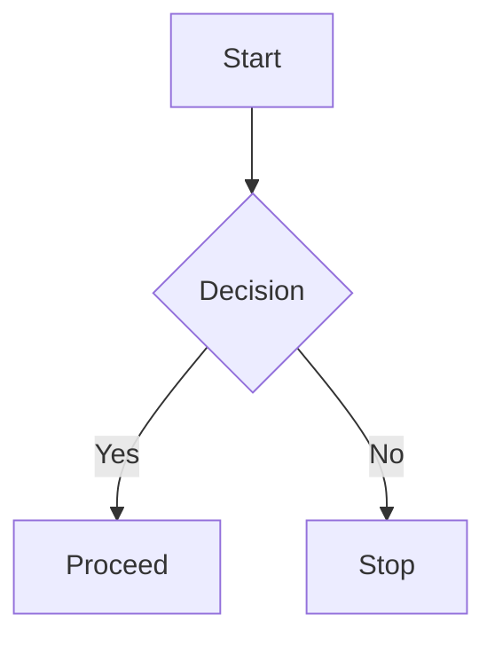

# Mermaid Chart

#### 🧜‍♀️ Mermaid Chart – Diagrams as Code, Simplified

The **Mermaid Chart** component in **Lowcoder** empowers users to create **diagrams using text-based syntax**. It’s a lightweight, flexible solution for visualizing processes, logic flows, and relationships — perfect for developers, analysts, and technical teams who prefer to "write" their charts.

#### 🧩 What You Can Create

With **Mermaid syntax**, you can render:

* **Flowcharts**
* **Gantt charts**
* **Sequence diagrams**
* **State diagrams**
* **Entity-relationship (ER) models**
* **Class diagrams**

#### 📝 Syntax Example (Flowchart)

Just paste this into the Mermaid Chart component’s text input and it renders a live diagram!

#### ⚙️ Configuration Options

* **Input Field:** Write or bind dynamic Mermaid syntax via `{{ }}`
* **Render Modes:** Adjust size, font, alignment, and padding
* **Dynamic Diagrams:** Generate diagrams from query outputs using JavaScript transformers

#### 🎨 Styling

While Mermaid comes with default themes, you can customize elements like:

* **Text labels**
* **Node shapes and colors**
* **Arrows and connectors**

Advanced theming is possible using [Mermaid theme variables](https://mermaid.js.org/config/theming.html).

### Component Playground



### Component Auto-Docs


