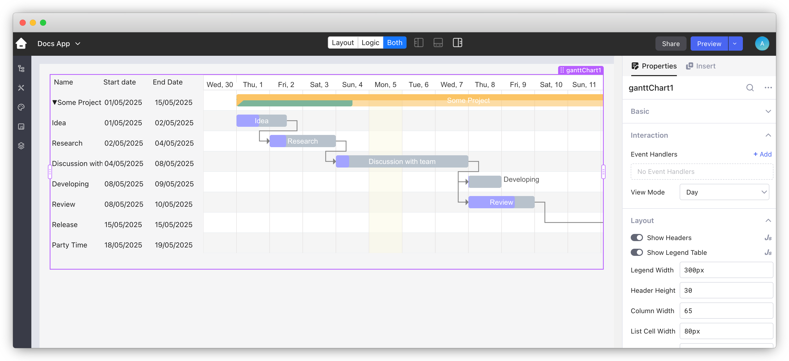

# Supabase RealTime

Supabase's **Realtime** feature is a powerful service that allows developers to build interactive, real-time applications by enabling instant updates to frontend clients when the underlying database changes. It is built on top of PostgreSQL's `logical replication` feature and uses WebSockets to push changes to subscribed clients. Here's a detailed explanation of how it works and its key features:

### How Supabase RealTime Works

* **PostgreSQL Logical Replication**: Supabase RealTime leverages PostgreSQL’s logical replication feature to stream database changes (inserts, updates, deletes) in real-time. Logical replication is a native PostgreSQL feature that captures changes from specific tables or schemas.
* **WebSocket Connection**: Once changes are detected via logical replication, they are broadcasted to all connected clients using WebSockets. Clients can subscribe to database tables or specific channels, and any changes are immediately pushed to them.

### Key Features of Supabase RealTime

* **Table Subscriptions**: You can subscribe to changes in specific database tables. For example, if you have a `users` table and want to know when a new user is created or updated, you can subscribe to this table, and Supabase will notify the client in real-time.
* **Event Types**: Supabase RealTime supports three types of events that clients can subscribe to:
  * **INSERT**: Triggered when a new row is added to the table.
  * **UPDATE**: Triggered when an existing row is modified.
  * **DELETE**: Triggered when a row is deleted from the table.
* **Row-Level Security**: Supabase RealTime respects PostgreSQL’s row-level security (RLS) policies. This ensures that clients can only receive updates for rows they have permission to access. You can enforce fine-grained security policies on a per-table or per-row basis.
* **Custom Channels**: In addition to subscribing to database changes, Supabase RealTime allows you to create and subscribe to custom channels for broadcasting arbitrary events, which can be useful for other real-time features in your app, such as chat or live notifications.
* **Filter Queries**: You can filter the real-time data updates to receive notifications only for specific changes that match certain conditions. This helps in optimizing the flow of real-time updates for clients that are interested in specific data.

More details related to Supabase RealTime can be be found here on their official website :[https://supabase.com/docs/guides/realtime](https://supabase.com/docs/guides/realtime)&#x20;

### Setting Up Supabase RealTime :&#x20;

#### 1. Enable RealTime

First, make sure Realtime is enabled in your Supabase project. This is usually done in the Supabase dashboard by toggling on the Realtime feature for specific tables or schemas.

<figure><figcaption><p>Enabling RealTime on a Supabase Table</p></figcaption></figure>

#### 2. Client Side Subscription / Initiating Connection

Once RealTime is enabled, initiate the connection to Supabase through a Stream query. Following is the formate for Stream query that you can use to make the connection to Supabase.

```
wss://{{your_supabase_project_reference_id}}.supabase.co/realtime/v1/websocket?apikey={{your_supabase_project_api_key}}&log_level=info&vsn=1.0.0
```

Supabase Project reference ID can be found in **Settings > Project Settings > General Settings.**

API key can be found in **Settings > Configuration > API > Project API keys.** Use the Anon Public key.

#### 3. Requesting Features/Services to use

After a successful connection, you need to subscribe to the changes on a Schema/Table that you want to listen to. PostgreSQL changes ( Insert, Update, Delete ) on an individual/multiple Tables in a Schema or all the tables in a Schema.&#x20;

```
{
   "event": "phx_reply",
   "topic": string,
   "payload": {
      "response": {
         "postgres_changes": [
            {
               "id": number,
               "event": "*" | "INSERT" | "UPDATE" | "DELETE",
               "schema": string,
               "table": string,
               "filter": string + '=' + "eq" | "neq" | "gt" | "gte" | "lt" | "lte" | "in" +  '.' + string
            }
         ]
      },
      "status": "ok" | "error"
   },
   "ref": string
}
```

#### 4. Keeping the Connection alive

The connection get timeout automatically after some time. So, to keep the connection alive we need to send the heartbeat after every 30 seconds. Use following code to send the Heartbeat request :&#x20;

```
{
   "event": "heartbeat",
   "topic": "phoenix",
   "payload": {},
   "ref": string
}
```

### Demo&#x20;

Now, let's show you a working demo where in a Ecommerce App, Admins will get RealTime notifications from Supabase whenever a Customer creates a new Order .


