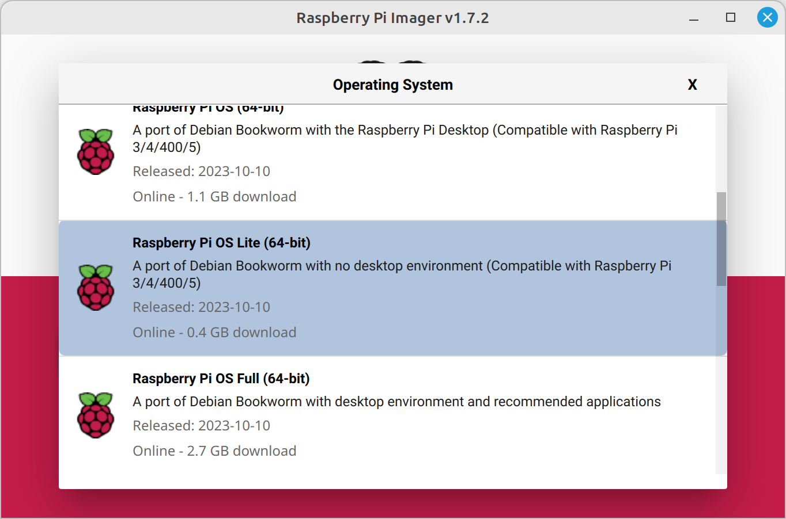
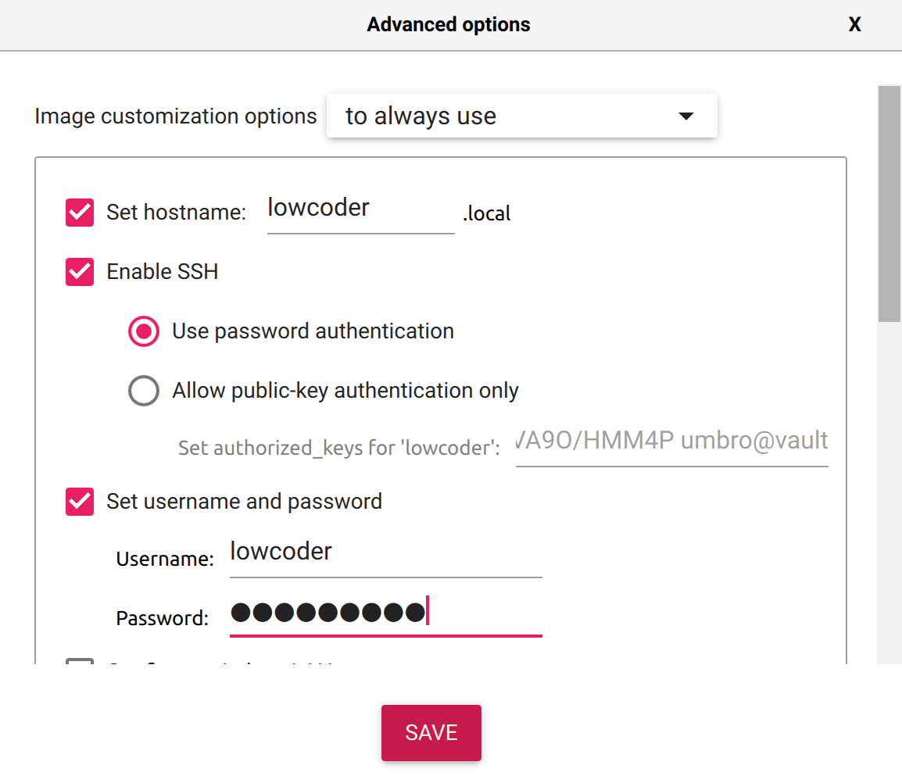

# Raspberry Pi

It is possible to install and run Lowcoder on Raspberry Pi.&#x20;

* install a 64bit OS eg. using [RPi Imager](https://www.raspberrypi.com/software/)

<figure><figcaption><p>Select Raspberry Pi OS (Other) -> Raspberry Pi OS Lite (64-bit)</p></figcaption></figure>

* while writing it to the SD card or USB stick, hit settings, enable SSH and change the user to `lowcoder`

<figure><figcaption><p>Enable SSH and set username to "lowcoder"</p></figcaption></figure>

Once done, boot up the device and do the following steps:

## Login via SSH to RPi

_(replace IP\_ADDRESS with the IP address of you RPi)_

`ssh lowcoder@IP_ADDRESS`

## Update installed system

```bash
sudo apt update
sudo apt full-upgrade
```

## Install docker

```bash
sudo install -m 0755 -d /etc/apt/keyrings
curl -fsSL https://download.docker.com/linux/ubuntu/gpg | sudo gpg --dearmor -o /etc/apt/keyrings/docker.gpg
sudo chmod a+r /etc/apt/keyrings/docker.gpg
echo \
  "deb [arch="$(dpkg --print-architecture)" signed-by=/etc/apt/keyrings/docker.gpg] https://download.docker.com/linux/debian \
  "$(. /etc/os-release && echo "$VERSION_CODENAME")" stable" | \
  sudo tee /etc/apt/sources.list.d/docker.list > /dev/null
sudo apt-get update
sudo apt-get install -y docker-ce docker-ce-cli containerd.io docker-buildx-plugin docker-compose-plugin
```

## Add lowcoder user to docker group

```bash
sudo usermod lowcoder -a -G docker
```

## Close connection to RPi and login again to apply the added group

```bash
exit
ssh lowcoder@IP_ADDRESS
```

## Create lowcoder application folders

```bash
mkdir -p lowcoder/lowcoder-stacks
cd lowcoder/
```

## Download lowcoder docker-compose file

```bash
wget 'https://raw.githubusercontent.com/lowcoder-org/lowcoder/main/deploy/docker/docker-compose.yaml'
```

## Update image name in downloaded docker-compose file

```bash
sed -i 's@image: lowcoderorg/lowcoder-ce:latest@image: ludomikula/lowcoder-ce:dev@' docker-compose.yaml
```

## Start lowcoder

```bash
docker compose up -d
```
